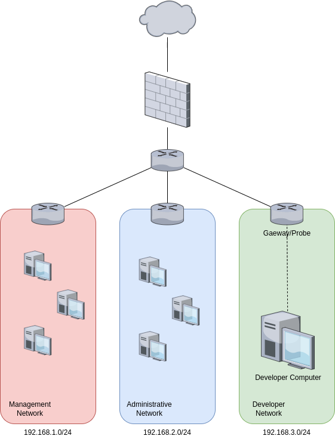
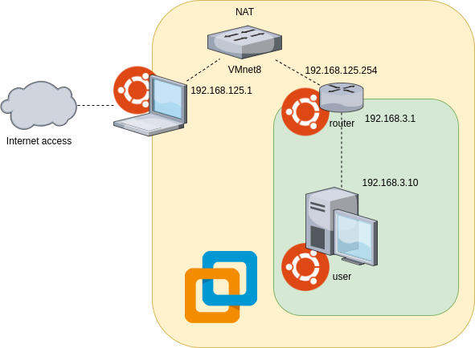
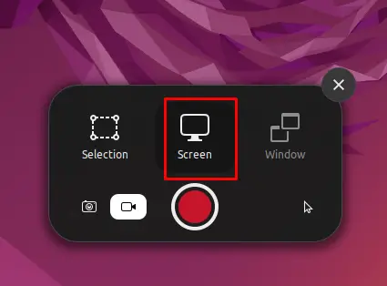

# Network Activity Traces 2024

This directory details the method used for recording and labeling datasets. It includes all the scripts that were used to create them.
## Architecture

The chosen architecture is rather simple. This is a company's network divided into 3 subnetworks for each team:

| Network        | Address     | masq          |
|----------------|-------------|---------------|
| Management     | 192.168.1.0 | 255.255.255.0 |
| Administrative | 192.168.2.0 | 255.255.255.0 |
| Developer      | 192.168.3.0 | 255.255.255.0 |



We are interested in the activities of one of the company's developers. To simulate this, we virtualize part of the network using VMware. Network data recording is done at the border router. The physical machine behaves like the coupling of the output router and the firewall.


## Record

The data recording phase is composed of several parts:
- Video recording
- Record of inputs (mouse and keyboard)
- Network capture

The first two records make it easier to label the dataset.

### Video Record
Video recording is done using the default tools under Ubuntu 22.04. We try to make the pointer appear clearly during capture to make it easier to follow the different actions.



The default output format is *.webm* which is very heavy. For easier processing, the video has been converted to *.mp4*.
### Record inputs (mouse and keyboard)
To retrieve the inputs we use the python library [python-evdev](https://python-evdev.readthedocs.io/en/latest/). It allows you to manage read and write input devices under Linux. First of all, it is necessary to identify which inputs our devices are located on. The following command allows you to list them:
```bash
$ ls -l /dev/input/by-id/*

lrwxrwxrwx 1 root root  9 avril  9 08:11 /dev/input/by-id/usb-4e53_USB_OPTICAL_MOUSE-event-mouse -> ../event9
lrwxrwxrwx 1 root root 10 avril  9 08:11 /dev/input/by-id/usb-4e53_USB_OPTICAL_MOUSE-if01-event-kbd -> ../event14
lrwxrwxrwx 1 root root  9 avril  9 08:11 /dev/input/by-id/usb-4e53_USB_OPTICAL_MOUSE-mouse -> ../mouse3
lrwxrwxrwx 1 root root  9 avril  9 08:10 /dev/input/by-id/usb-NOVATEK_USB_Keyboard-event-if01 -> ../event8
lrwxrwxrwx 1 root root  9 avril  9 08:10 /dev/input/by-id/usb-NOVATEK_USB_Keyboard-event-kbd -> ../event5
```

In our case we have the following inputs:

| Device   | File              | 
|----------|-------------------|
| Keyboard | /dev/input/event5 | 
| Mouse    | /dev/input/event9 | 

It is important to adapt the parameters of the **Recorder.py** script accordingly.
### Network Capture

Network capture is done at the edge router using a simple command line using tshark:
```bash
$ tshark -i <interface> -w <nom_du_fichier>
```

To obtain the flows, we can use the **Converter.py** script which uses the python library [NFStream](https://www.nfstream.org/) using the following command:
```bash
$ python3 Converter.py <PCAP filename>
```
You will get the file of the same name in *.csv* format.
## Data labeling
Data labeling is partly done automatically using the **Processing.py** script.
```bash
$ python3 Processing.py
```
It will read the data from the *event_file.txt* file which contains the input data (keyboard + mouse) recorded previously. The data format is as follows:
```
event at 1712649868.332587, code 272, type 01, val 01
```

Each line consists of the timestamp of the event, followed by the code corresponding to the entry, its type and finally its value. The codes and types, although often similar, are device specific. They can be found using the following command:
```bash
$ sudo evemu-describe
```
In our case, we decided to only take into account the codes below, considering that these are the most commonly used actions and generate the most operations.

| Code | Device   | Event                                 | 
|------|----------|---------------------------------------|
| 272  | Mouse    | BTN_LEFT                              | 
| 273  | Mouse    | BTN_RIGHT                             | 
| 274  | Mouse    | BTN_MIDDLE *(wheel click)*           | 
| 28   | Keyboard | KEY_ENTER                             | 
| 96   | Keyboard | KEY_KPENTER *(numeric keypad enter key)* | 

These events can take 2 values, **01** when the key/click is pressed and **00** when it is released.
We are therefore looking for all the timestamps where one of the events corresponding to one of these actions occurred at the moment the key/click was released.
Then, manually, we label the columns Actions, Activities and Applications.